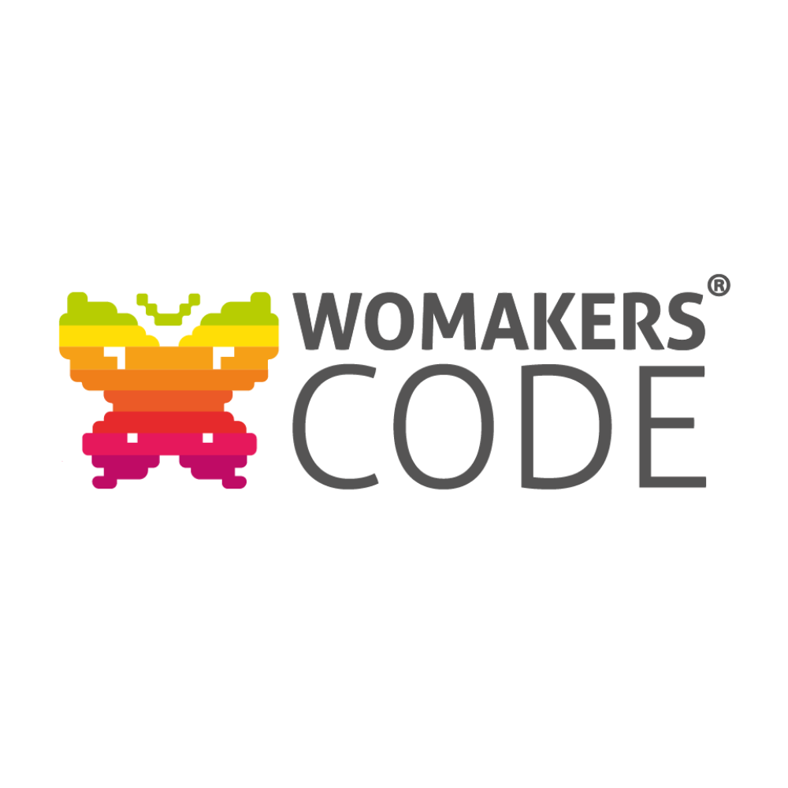

<h1 align="center">
    
</h1>

 

## 🚀 Ferramentas e tecnologias usadas para realizar os exercícios

Esse projeto foi desenvolvido utilizando as seguintes tecnologias:

- [Python](https://www.python.org/)
- [GitHub](https://github.com/camilagomo)
- [VsCode](https://code.visualstudio.com/)

## 💻 Projeto

Data Analytics 💜 

Programa de formação para mulheres na área de análise de dados, com duração de 6,5 meses, com mentoria de carreira e conexões com mercado de trabalho ministrados pela **[WoMakersCode](https://womakerscode.org/data-analytics/)**

Desenvolvido por Camila Monteiro
